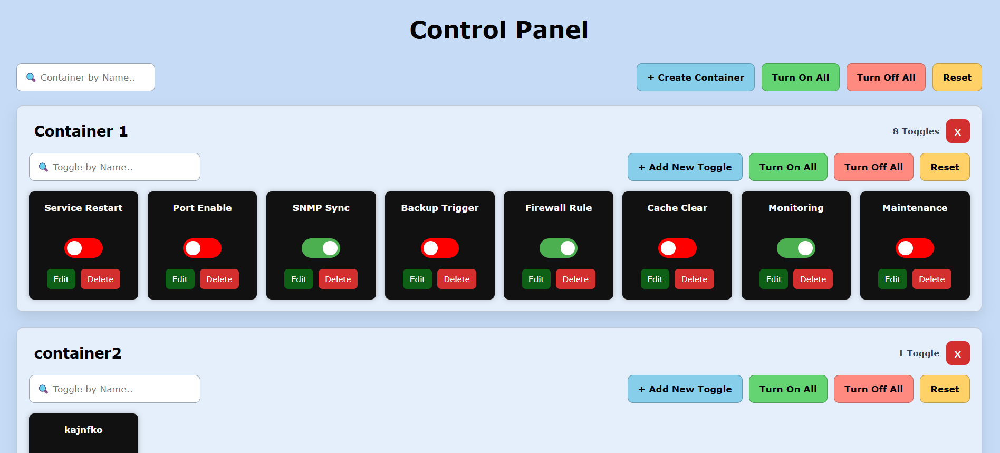

# Dynamic Toggle Control Panel

A web-based control panel for remotely operating industrial devices over **Modbus TCP**, built with PHP, vanilla JavaScript, and JSON-based storage. Designed for deployment across multiple servers with automatic real-time device state synchronization.

---

## What It Does

Each toggle card in the UI is mapped to a real device (such as a relay, switch, or PLC output). Clicking a toggle sends a shell command (e.g. `mbpoll`) to the device over the network. All connected servers automatically reflect the current device state every 5 seconds by polling the device directly — so if one server turns a device ON, every other server's UI updates on its own.

---

## Features

- **Toggle cards** — each card holds a label, an ON command, an OFF command, and an optional status command
- **Containers** — group toggles into named containers; create, rename, or delete containers from the UI
- **Real-time sync** — a 5-second polling loop reads live device state via the status command and updates the UI automatically across all servers
- **Bulk actions** — Turn On All, Turn Off All, and Reset buttons at both the page level and per-container level
- **Sequential bulk execution** — bulk commands fire one at a time with a 150 ms gap to avoid flooding the Modbus device and prevent file write race conditions
- **Smart polling guard** — manually toggled switches are protected from being overridden by the poller for 10 seconds, giving the device time to settle
- **Search and filter** — search containers by name and toggles by name within each container
- **Responsive UI** — scales from large desktop grids down to mobile layouts using CSS clamp and grid

---

## Tech Stack

| Layer | Technology |
|---|---|
| Frontend | HTML, CSS, Vanilla JavaScript |
| Backend | PHP (no framework) |
| Storage | JSON files |
| Device Communication | `mbpoll` CLI (Modbus TCP) |
| Protocol | Modbus TCP (port 502) |

---

## Project Structure

```
├── index.php              # Main HTML page and modal templates
├── toggle_action.php      # Backend API — handles all CRUD and device commands
├── toggle_app.js          # Frontend logic — rendering, polling, bulk actions
├── toggle_style.css       # All styling and responsive layout
├── toggles.json           # Toggle definitions (label, commands, container)
├── containers.json        # Container definitions
└── toggle_state.json      # Last known ON/OFF state fallback for each toggle
```

---

## How It Works

### Toggle Commands
Each toggle stores three shell commands:

- **ON Command** — runs when the toggle is switched ON (e.g. `mbpoll -m tcp 10.10.10.30 -p 502 -a 2 -r 1 -t 0 1`)
- **OFF Command** — runs when the toggle is switched OFF
- **Status Command** — runs every 5 seconds to read the real device state (e.g. `mbpoll -1 -m tcp 10.10.10.30 -p 502 -a 2 -r 1 -t 0 | awk '/^\[1\]:/ {print $2}'`)

### Multi-Server Sync
All servers share the same physical devices. Since each server polls the device directly using the status command, they all converge to the same real device state within 5 seconds — no shared database or message broker needed.

### Bulk Action Safety
Bulk commands use `async/await` with a 150 ms delay between each toggle instead of firing all at once. This prevents:
- Modbus device overload from simultaneous TCP connections
- Race conditions on `toggle_state.json` from concurrent PHP writes
- Toggles without a configured command being sent empty requests

---

## Setup

### Requirements
- PHP 7.4+ with `shell_exec` enabled
- `mbpoll` installed on the server (`apt install mbpoll` on Debian/Ubuntu)
- A Modbus TCP-capable device reachable from the server

### Installation
1. Clone the repository into your web server's document root (Apache/Nginx)
2. Make sure the web server user has permission to write JSON files in the project folder
3. Open `index.php` in your browser
4. Create a container, add a toggle, and fill in your Modbus commands

### Adding a Toggle
When creating or editing a toggle, fill in:
- **Toggle Name** — a label shown on the card
- **ON Command** — shell command to turn the device ON
- **OFF Command** — shell command to turn the device OFF
- **Status Command** — shell command that returns `1` (ON) or `0` (OFF); used for auto-sync

---

## Notes

- `toggle_state.json` acts as a fallback for toggles that have no status command — it remembers the last known state across page refreshes
- Toggles without an ON or OFF command are automatically skipped during bulk actions
- The status poller ignores command output that is not exactly `"0"` or `"1"` (e.g. error messages from unreachable devices) so the UI is never incorrectly forced to OFF

---

## Screenshots



---

## License

This project was built for internal infrastructure use. Feel free to adapt it for your own projects.